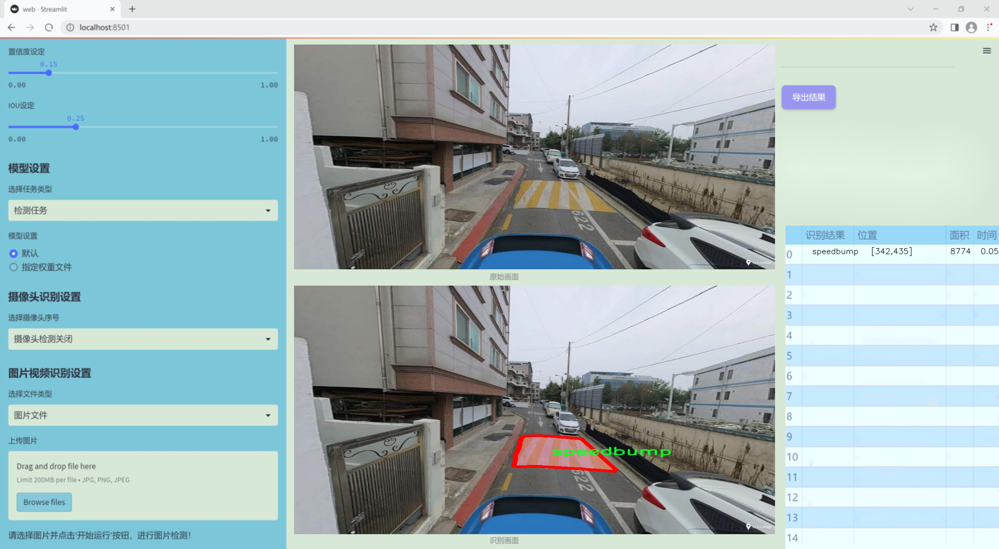

### 1.背景意义

研究背景与意义

随着城市化进程的加快，交通安全问题日益突出，尤其是道路标识的清晰可见性和准确性直接影响到行人和驾驶员的安全。传统的道路标识检测方法往往依赖于人工标注和经验判断，效率低下且容易受到环境因素的影响。因此，基于计算机视觉的自动化检测系统逐渐成为研究的热点。近年来，深度学习技术的快速发展为图像识别和目标检测提供了新的解决方案，其中YOLO（You Only Look Once）系列模型因其高效性和实时性而受到广泛关注。

本研究旨在基于改进的YOLOv11模型，构建一个高效的道路标识元素检测系统。该系统将针对包括人行横道、车道、装卸区、坑洼、道路分隔线、道路标记和减速带等七类道路标识进行检测与识别。通过使用包含4700张图像的ROAD-REAL数据集，系统将能够在多种复杂的城市交通环境中进行有效的标识检测。这一数据集不仅涵盖了多种类型的道路标识，还为模型的训练和评估提供了丰富的样本，有助于提高模型的泛化能力和准确性。

改进YOLOv11模型的引入，旨在提升检测精度和速度，尤其是在复杂背景和多变光照条件下的表现。通过对模型架构的优化和训练策略的调整，期望能够实现更高的检测率和更低的误检率。此外，本研究还将探讨如何通过数据增强和迁移学习等技术，进一步提升模型的性能。最终，所构建的道路标识元素检测系统将为智能交通管理、自动驾驶技术的发展提供重要的技术支持，推动交通安全的提升和城市交通系统的智能化进程。

### 2.视频效果

[2.1 视频效果](https://www.bilibili.com/video/BV14UkCYEEdL/)

### 3.图片效果




##### [项目涉及的源码数据来源链接](https://kdocs.cn/l/cszuIiCKVNis)**

注意：本项目提供训练的数据集和训练教程,由于版本持续更新,暂不提供权重文件（best.pt）,请按照6.训练教程进行训练后实现上图演示的效果。

### 4.数据集信息

##### 4.1 本项目数据集类别数＆类别名

nc: 7
names: ['crosswalk', 'lane', 'loading-box', 'pothole', 'road_separator', 'roadmarking', 'speedbump']


该项目为【图像分割】数据集，请在【训练教程和Web端加载模型教程（第三步）】这一步的时候按照【图像分割】部分的教程来训练

##### 4.2 本项目数据集信息介绍

本项目数据集信息介绍

本项目所使用的数据集名为“ROAD-REAL”，旨在为改进YOLOv11的道路标识元素检测系统提供高质量的训练数据。该数据集专注于城市道路环境中的关键元素，涵盖了七个主要类别，分别为：人行横道（crosswalk）、车道（lane）、装卸区（loading-box）、坑洼（pothole）、道路分隔线（road_separator）、道路标线（roadmarking）以及减速带（speedbump）。这些类别的选择不仅反映了城市交通管理的实际需求，也为智能交通系统的研究提供了丰富的素材。

在数据集的构建过程中，特别注重了数据的多样性和代表性。数据来源于不同城市的真实道路场景，涵盖了多种天气条件和时间段，以确保模型在各种环境下的鲁棒性。每个类别的样本均经过精心标注，确保标注的准确性和一致性，从而为YOLOv11的训练提供了坚实的基础。

通过使用“ROAD-REAL”数据集，研究团队希望能够有效提升YOLOv11在道路标识元素检测中的性能，进而推动智能交通系统的发展。该数据集不仅为算法的训练提供了必要的支持，也为后续的模型评估和优化奠定了基础。未来，随着数据集的不断扩展和完善，预期将为更复杂的交通场景分析提供更多的可能性，助力智能交通领域的进一步研究与应用。


### 5.全套项目环境部署视频教程（零基础手把手教学）

[5.1 所需软件PyCharm和Anaconda安装教程（第一步）](https://www.bilibili.com/video/BV1BoC1YCEKi/?spm_id_from=333.999.0.0&vd_source=bc9aec86d164b67a7004b996143742dc)


[5.2 安装Python虚拟环境创建和依赖库安装视频教程（第二步）](https://www.bilibili.com/video/BV1ZoC1YCEBw?spm_id_from=333.788.videopod.sections&vd_source=bc9aec86d164b67a7004b996143742dc)

### 6.改进YOLOv11训练教程和Web_UI前端加载模型教程（零基础手把手教学）

[6.1 改进YOLOv11训练教程和Web_UI前端加载模型教程（第三步）](https://www.bilibili.com/video/BV1BoC1YCEhR?spm_id_from=333.788.videopod.sections&vd_source=bc9aec86d164b67a7004b996143742dc)


按照上面的训练视频教程链接加载项目提供的数据集，运行train.py即可开始训练



     Epoch   gpu_mem       box       obj       cls    labels  img_size
     1/200     20.8G   0.01576   0.01955  0.007536        22      1280: 100%|██████████| 849/849 [14:42<00:00,  1.04s/it]
               Class     Images     Labels          P          R     mAP@.5 mAP@.5:.95: 100%|██████████| 213/213 [01:14<00:00,  2.87it/s]
                 all       3395      17314      0.994      0.957      0.0957      0.0843

     Epoch   gpu_mem       box       obj       cls    labels  img_size
     2/200     20.8G   0.01578   0.01923  0.007006        22      1280: 100%|██████████| 849/849 [14:44<00:00,  1.04s/it]
               Class     Images     Labels          P          R     mAP@.5 mAP@.5:.95: 100%|██████████| 213/213 [01:12<00:00,  2.95it/s]
                 all       3395      17314      0.996      0.956      0.0957      0.0845

     Epoch   gpu_mem       box       obj       cls    labels  img_size
     3/200     20.8G   0.01561    0.0191  0.006895        27      1280: 100%|██████████| 849/849 [10:56<00:00,  1.29it/s]
               Class     Images     Labels          P          R     mAP@.5 mAP@.5:.95: 100%|███████   | 187/213 [00:52<00:00,  4.04it/s]
                 all       3395      17314      0.996      0.957      0.0957      0.0845


###### [项目数据集下载链接](https://kdocs.cn/l/cszuIiCKVNis)

### 7.原始YOLOv11算法讲解

##### YOLO11简介

> YOLO11源码地址：https://github.com/ultralytics/ultralytics

Ultralytics
YOLO11是一款尖端的、最先进的模型，它在之前YOLO版本成功的基础上进行了构建，并引入了新功能和改进，以进一步提升性能和灵活性。YOLO11设计快速、准确且易于使用，使其成为各种物体检测和跟踪、实例分割、图像分类以及姿态估计任务的绝佳选择。  


**YOLO11创新点如下:**

YOLO 11主要改进包括：  
`增强的特征提取`：YOLO 11采用了改进的骨干和颈部架构，增强了特征提取功能，以实现更精确的目标检测。  
`优化的效率和速度`：优化的架构设计和优化的训练管道提供更快的处理速度，同时保持准确性和性能之间的平衡。  
`更高的精度，更少的参数`：YOLO11m在COCO数据集上实现了更高的平均精度（mAP），参数比YOLOv8m少22%，使其在不影响精度的情况下提高了计算效率。  
`跨环境的适应性`：YOLO 11可以部署在各种环境中，包括边缘设备、云平台和支持NVIDIA GPU的系统。  
`广泛的支持任务`：YOLO 11支持各种计算机视觉任务，如对象检测、实例分割、图像分类、姿态估计和面向对象检测（OBB）。

**YOLO11不同模型尺寸信息：**

YOLO11 提供5种不同的型号规模模型，以满足不同的应用需求：

Model| size (pixels)| mAPval 50-95| Speed CPU ONNX (ms)| Speed T4 TensorRT10
(ms)| params (M)| FLOPs (B)  
---|---|---|---|---|---|---  
YOLO11n| 640| 39.5| 56.1 ± 0.8| 1.5 ± 0.0| 2.6| 6.5  
YOLO11s| 640| 47.0| 90.0 ± 1.2| 2.5 ± 0.0| 9.4| 21.5  
YOLO11m| 640| 51.5| 183.2 ± 2.0| 4.7 ± 0.1| 20.1| 68.0  
YOLO11l| 640| 53.4| 238.6 ± 1.4| 6.2 ± 0.1| 25.3| 86.9  
YOLO11x| 640| 54.7| 462.8 ± 6.7| 11.3 ± 0.2| 56.9| 194.9  
  
**模型常用训练超参数参数说明：**  
`YOLOv11
模型的训练设置包括训练过程中使用的各种超参数和配置`。这些设置会影响模型的性能、速度和准确性。关键的训练设置包括批量大小、学习率、动量和权重衰减。此外，优化器、损失函数和训练数据集组成的选择也会影响训练过程。对这些设置进行仔细的调整和实验对于优化性能至关重要。  
**以下是一些常用的模型训练参数和说明：**

参数名| 默认值| 说明  
---|---|---  
`model`| `None`| 指定用于训练的模型文件。接受指向 `.pt` 预训练模型或 `.yaml`
配置文件。对于定义模型结构或初始化权重至关重要。  
`data`| `None`| 数据集配置文件的路径（例如
`coco8.yaml`).该文件包含特定于数据集的参数，包括训练数据和验证数据的路径、类名和类数。  
`epochs`| `100`| 训练总轮数。每个epoch代表对整个数据集进行一次完整的训练。调整该值会影响训练时间和模型性能。  
`patience`| `100`| 在验证指标没有改善的情况下，提前停止训练所需的epoch数。当性能趋于平稳时停止训练，有助于防止过度拟合。  
`batch`| `16`| 批量大小，有三种模式:设置为整数(例如，’ Batch =16 ‘)， 60% GPU内存利用率的自动模式(’ Batch
=-1 ‘)，或指定利用率分数的自动模式(’ Batch =0.70 ')。  
`imgsz`| `640`| 用于训练的目标图像尺寸。所有图像在输入模型前都会被调整到这一尺寸。影响模型精度和计算复杂度。  
`device`| `None`| 指定用于训练的计算设备：单个 GPU (`device=0`）、多个 GPU (`device=0,1`)、CPU
(`device=cpu`)，或苹果芯片的 MPS (`device=mps`).  
`workers`| `8`| 加载数据的工作线程数（每 `RANK` 多 GPU 训练）。影响数据预处理和输入模型的速度，尤其适用于多 GPU 设置。  
`name`| `None`| 训练运行的名称。用于在项目文件夹内创建一个子目录，用于存储训练日志和输出结果。  
`pretrained`| `True`| 决定是否从预处理模型开始训练。可以是布尔值，也可以是加载权重的特定模型的字符串路径。提高训练效率和模型性能。  
`optimizer`| `'auto'`| 为训练模型选择优化器。选项包括 `SGD`, `Adam`, `AdamW`, `NAdam`,
`RAdam`, `RMSProp` 等，或 `auto` 用于根据模型配置进行自动选择。影响收敛速度和稳定性  
`lr0`| `0.01`| 初始学习率（即 `SGD=1E-2`, `Adam=1E-3`) .调整这个值对优化过程至关重要，会影响模型权重的更新速度。  
`lrf`| `0.01`| 最终学习率占初始学习率的百分比 = (`lr0 * lrf`)，与调度程序结合使用，随着时间的推移调整学习率。  


**各损失函数作用说明：**  
`定位损失box_loss`：预测框与标定框之间的误差（GIoU），越小定位得越准；  
`分类损失cls_loss`：计算锚框与对应的标定分类是否正确，越小分类得越准；  
`动态特征损失（dfl_loss）`：DFLLoss是一种用于回归预测框与目标框之间距离的损失函数。在计算损失时，目标框需要缩放到特征图尺度，即除以相应的stride，并与预测的边界框计算Ciou
Loss，同时与预测的anchors中心点到各边的距离计算回归DFLLoss。  


### 8.200+种全套改进YOLOV11创新点原理讲解

#### 8.1 200+种全套改进YOLOV11创新点原理讲解大全

由于篇幅限制，每个创新点的具体原理讲解就不全部展开，具体见下列网址中的改进模块对应项目的技术原理博客网址【Blog】（创新点均为模块化搭建，原理适配YOLOv5~YOLOv11等各种版本）

[改进模块技术原理博客【Blog】网址链接](https://gitee.com/qunmasj/good)


#### 8.2 精选部分改进YOLOV11创新点原理讲解

###### 这里节选部分改进创新点展开原理讲解(完整的改进原理见上图和[改进模块技术原理博客链接](https://gitee.com/qunmasj/good)【如果此小节的图加载失败可以通过CSDN或者Github搜索该博客的标题访问原始博客，原始博客图片显示正常】

### ParC融合位置感知循环卷积简介
ParC：Position aware circular convolution


#### Position aware circular convolution
针对于全局信息的提取作者提出了Position aware circular convolution（也称作Global Circular Convolution）。图中左右实际是对于该操作水平竖直两方向的对称，理解时只看左边即可。对于维度为C*H*W的输入，作者先将维度为C*B*1的Position Embedding通过双线性插值函数F调整到适合input的维度C*H*1（以适应不同特征大小输入），并且将PE水平复制扩展到C*H*W维度与输入特征相加。这里作者将PE直接设置成为了可学习的参数。

接下来参考该博客将加入PE的特征图竖直方向堆叠，并且同样以插值的方式得到了适应输入维度的C*H*1大小的卷积核，进行卷积操作。对于这一步卷积，作者将之称为循环卷积，并给出了一个卷积示意图。


但个人感觉实际上这个示意图只是为了说明为什么叫循环卷积，对于具体的计算细节还是根据公式理解更好。


进一步，作者给出了这一步的伪代码来便于读者对这一卷积的理解：y=F.conv2D（torch.cat（xp，xp，dim=2），kV），实际上就是将xp堆叠之后使用了一个“条形（或柱形）”卷积核进行简单的卷积操作。（但这样会导致多一次重复卷积，因此在堆叠示意图中只取了前2*H-1行）

可以看到在示意图中特征维度变化如下：C*(2H-1)*W ---C*H*1--->C*H*W，作者特意带上了通道数，并且并没有出现通道数的改变，那么这里所进行的卷积应该是depth wise卷积，通过对文章后续以及论文源码的阅读可以得知这一步进行的就是DW卷积。（we introduce group convolution and point wise convolution into these modules, which decreases number of parameters without hurting performance.）


由groups = channel可知使用的是DW卷积
通过上面就完成了一次竖直方向的全局信息交流，同样只要在水平方向进行同样的操作即可做到水平方向的全局信息交流。

#### ParC block

通过ParC成功解决了全局信息提取的问题，接下来就是针对2）3）两点进行改进。首先是Meta-Former模块，Meta-Former由Token Mixer和Channel Mixer构成，ParC首先满足了Token Mixer的全局信息提取的要求，并且相较于Attention在计算成本上更低。


这里①中的PWC即point wise conv，进一步验证了我们前面对于深度可分离卷积的想法，而GCC-H/V即是前面所说的ParC-H/V。

①构建了Meta-Former中的Token mixer模块，那么最后剩下的问题就是3），替换掉Attention模块之后模型不再data driven。为了解决这一点作者给出了一个channel wise attention，先将特征图（x,C*H*W）进行global average（a,C*1*1）并输入一个MLP生成一个channel wise的权重（w,C*1*1），再将权重与特征图在通道方向相乘得到输出（output = wx,C*H*W）。

#### ParC net
对于ParC net 的搭建，作者直接基于MobileViT，采用了分叉结构（c）完成了网络的搭建。


具体而言作者保留了MobileViT中浅层具有局部感受野的MobileNetV2结构，而将网络深层的ViT block替换成了ParC block，使网络变成了一个pure ConvNet。


### 9.系统功能展示

图9.1.系统支持检测结果表格显示

  图9.2.系统支持置信度和IOU阈值手动调节

  图9.3.系统支持自定义加载权重文件best.pt(需要你通过步骤5中训练获得)

  图9.4.系统支持摄像头实时识别

  图9.5.系统支持图片识别

  图9.6.系统支持视频识别

  图9.7.系统支持识别结果文件自动保存

  图9.8.系统支持Excel导出检测结果数据


### 10. YOLOv11核心改进源码讲解

#### 10.1 convnextv2.py

以下是经过精简和注释的核心代码部分，主要保留了模型的基本结构和关键组件：

```python
import torch
import torch.nn as nn
import torch.nn.functional as F

class LayerNorm(nn.Module):
    """ 实现层归一化，支持两种数据格式：channels_last 和 channels_first。 """
    def __init__(self, normalized_shape, eps=1e-6, data_format="channels_last"):
        super().__init__()
        self.weight = nn.Parameter(torch.ones(normalized_shape))  # 权重参数
        self.bias = nn.Parameter(torch.zeros(normalized_shape))    # 偏置参数
        self.eps = eps
        self.data_format = data_format
        if self.data_format not in ["channels_last", "channels_first"]:
            raise NotImplementedError 

    def forward(self, x):
        """ 前向传播，执行层归一化。 """
        if self.data_format == "channels_last":
            return F.layer_norm(x, self.weight, self.bias, self.eps)
        elif self.data_format == "channels_first":
            u = x.mean(1, keepdim=True)  # 计算均值
            s = (x - u).pow(2).mean(1, keepdim=True)  # 计算方差
            x = (x - u) / torch.sqrt(s + self.eps)  # 标准化
            return self.weight[:, None, None] * x + self.bias[:, None, None]  # 应用权重和偏置

class Block(nn.Module):
    """ ConvNeXtV2 的基本块。 """
    def __init__(self, dim, drop_path=0.):
        super().__init__()
        self.dwconv = nn.Conv2d(dim, dim, kernel_size=7, padding=3, groups=dim)  # 深度卷积
        self.norm = LayerNorm(dim, eps=1e-6)  # 归一化层
        self.pwconv1 = nn.Linear(dim, 4 * dim)  # 1x1 卷积（点卷积）
        self.act = nn.GELU()  # 激活函数
        self.pwconv2 = nn.Linear(4 * dim, dim)  # 1x1 卷积
        self.drop_path = nn.Identity() if drop_path <= 0. else nn.Dropout(drop_path)  # 随机深度

    def forward(self, x):
        """ 前向传播，执行卷积和归一化操作。 """
        input = x
        x = self.dwconv(x)  # 深度卷积
        x = self.norm(x)  # 归一化
        x = self.pwconv1(x)  # 第一个点卷积
        x = self.act(x)  # 激活
        x = self.pwconv2(x)  # 第二个点卷积
        x = input + self.drop_path(x)  # 残差连接和随机深度
        return x

class ConvNeXtV2(nn.Module):
    """ ConvNeXt V2 模型。 """
    def __init__(self, in_chans=3, num_classes=1000, depths=[3, 3, 9, 3], dims=[96, 192, 384, 768]):
        super().__init__()
        self.downsample_layers = nn.ModuleList()  # 下采样层
        # Stem layer
        stem = nn.Sequential(
            nn.Conv2d(in_chans, dims[0], kernel_size=4, stride=4),
            LayerNorm(dims[0], eps=1e-6, data_format="channels_first")
        )
        self.downsample_layers.append(stem)
        # 中间下采样层
        for i in range(3):
            downsample_layer = nn.Sequential(
                LayerNorm(dims[i], eps=1e-6, data_format="channels_first"),
                nn.Conv2d(dims[i], dims[i+1], kernel_size=2, stride=2),
            )
            self.downsample_layers.append(downsample_layer)

        self.stages = nn.ModuleList()  # 特征分辨率阶段
        for i in range(4):
            stage = nn.Sequential(
                *[Block(dim=dims[i]) for _ in range(depths[i])]  # 每个阶段的多个残差块
            )
            self.stages.append(stage)

        self.norm = nn.LayerNorm(dims[-1], eps=1e-6)  # 最终归一化层
        self.head = nn.Linear(dims[-1], num_classes)  # 分类头

    def forward(self, x):
        """ 前向传播，经过下采样层和阶段。 """
        for i in range(4):
            x = self.downsample_layers[i](x)  # 下采样
            x = self.stages[i](x)  # 特征提取
        return x  # 返回最后的特征图

# 模型构建函数
def convnextv2(weights='', **kwargs):
    model = ConvNeXtV2(**kwargs)  # 创建模型
    if weights:
        model.load_state_dict(torch.load(weights)['model'])  # 加载权重
    return model
```

### 代码核心部分分析：
1. **LayerNorm**: 实现了层归一化，支持不同的输入格式，确保模型在训练过程中能够稳定。
2. **Block**: ConvNeXtV2的基本构建块，包含深度卷积、归一化、激活和残差连接。
3. **ConvNeXtV2**: 整个模型的架构，包含下采样层和多个阶段，每个阶段由多个Block组成。
4. **forward方法**: 定义了模型的前向传播过程，逐层处理输入数据并提取特征。

以上是对代码的核心部分进行了提炼和详细注释，便于理解模型的结构和功能。

这个文件实现了一个名为ConvNeXt V2的深度学习模型，主要用于图像分类任务。该模型基于卷积神经网络（CNN）架构，结合了一些新的技术和设计理念，以提高性能和效率。

首先，文件中定义了一些必要的库，包括PyTorch和一些自定义的层。接着，定义了几个类，分别实现了不同的功能。

LayerNorm类实现了层归一化，支持两种数据格式：channels_last（默认）和channels_first。这个类的构造函数接收归一化的形状、一个小的常数（eps）以避免除零错误，以及数据格式。前向传播方法根据输入的数据格式选择不同的归一化方式。

GRN类实现了全局响应归一化层，它通过计算输入的L2范数并进行归一化来调整输入特征的响应。这个类的构造函数定义了两个可学习的参数gamma和beta，用于调整归一化后的输出。

Block类是ConvNeXt V2的基本构建块。它包含一个深度可分离卷积层、层归一化、两个线性层（模拟1x1卷积）、激活函数（GELU）和GRN层。前向传播方法中，输入经过深度卷积、归一化、线性变换和GRN后，再通过另一个线性层输出，最后与输入相加（残差连接），并应用随机深度（DropPath）策略。

ConvNeXtV2类是整个模型的主体。它的构造函数定义了输入通道数、分类头的类别数、每个阶段的块数、特征维度、随机深度率和分类器权重的初始化缩放值。模型由多个下采样层和特征分辨率阶段组成，每个阶段包含多个Block。构造函数中还定义了一个最终的层归一化和线性分类头，并初始化权重。

在forward方法中，输入数据依次经过下采样层和特征阶段，最终返回特征图。

文件还定义了一些函数用于创建不同规模的ConvNeXt V2模型，如convnextv2_atto、convnextv2_femto等。这些函数根据不同的深度和维度参数初始化模型，并在提供权重文件时加载预训练权重。

最后，update_weight函数用于更新模型的权重，确保加载的权重与模型的结构相匹配。

总体来说，这个文件实现了一个灵活且高效的图像分类模型，利用了现代深度学习中的一些重要技术，如层归一化、全局响应归一化和随机深度等。

#### 10.2 efficientViT.py

以下是代码中最核心的部分，并附上详细的中文注释：

```python
import torch
import torch.nn as nn
import torch.nn.functional as F
import itertools

# 定义一个卷积层加批归一化的组合
class Conv2d_BN(torch.nn.Sequential):
    def __init__(self, in_channels, out_channels, kernel_size=1, stride=1, padding=0, dilation=1,
                 groups=1, bn_weight_init=1):
        super().__init__()
        # 添加卷积层
        self.add_module('c', torch.nn.Conv2d(
            in_channels, out_channels, kernel_size, stride, padding, dilation, groups, bias=False))
        # 添加批归一化层
        self.add_module('bn', torch.nn.BatchNorm2d(out_channels))
        # 初始化批归一化的权重
        torch.nn.init.constant_(self.bn.weight, bn_weight_init)
        torch.nn.init.constant_(self.bn.bias, 0)

    @torch.no_grad()
    def switch_to_deploy(self):
        # 将训练模式下的卷积和批归一化合并为一个卷积层
        c, bn = self._modules.values()
        w = bn.weight / (bn.running_var + bn.eps)**0.5
        w = c.weight * w[:, None, None, None]
        b = bn.bias - bn.running_mean * bn.weight / (bn.running_var + bn.eps)**0.5
        m = torch.nn.Conv2d(w.size(1) * self.c.groups, w.size(0), w.shape[2:], stride=self.c.stride, padding=self.c.padding, dilation=self.c.dilation, groups=self.c.groups)
        m.weight.data.copy_(w)
        m.bias.data.copy_(b)
        return m

# 定义一个残差块
class Residual(torch.nn.Module):
    def __init__(self, module, drop=0.):
        super().__init__()
        self.module = module  # 保存传入的模块
        self.drop = drop  # 丢弃率

    def forward(self, x):
        # 如果在训练模式下且丢弃率大于0，随机丢弃部分输入
        if self.training and self.drop > 0:
            return x + self.module(x) * torch.rand(x.size(0), 1, 1, 1,
                                                    device=x.device).ge_(self.drop).div(1 - self.drop).detach()
        else:
            return x + self.module(x)  # 返回残差连接的结果

# 定义一个前馈神经网络（FFN）
class FFN(torch.nn.Module):
    def __init__(self, input_dim, hidden_dim):
        super().__init__()
        self.pw1 = Conv2d_BN(input_dim, hidden_dim)  # 第一个卷积层
        self.act = torch.nn.ReLU()  # 激活函数
        self.pw2 = Conv2d_BN(hidden_dim, input_dim, bn_weight_init=0)  # 第二个卷积层

    def forward(self, x):
        x = self.pw2(self.act(self.pw1(x)))  # 前向传播
        return x

# 定义EfficientViT模型
class EfficientViT(torch.nn.Module):
    def __init__(self, img_size=400, patch_size=16, embed_dim=[64, 128, 192], depth=[1, 2, 3], num_heads=[4, 4, 4]):
        super().__init__()
        # 图像嵌入层
        self.patch_embed = torch.nn.Sequential(
            Conv2d_BN(3, embed_dim[0] // 8, 3, 2, 1),
            torch.nn.ReLU(),
            Conv2d_BN(embed_dim[0] // 8, embed_dim[0] // 4, 3, 2, 1),
            torch.nn.ReLU(),
            Conv2d_BN(embed_dim[0] // 4, embed_dim[0] // 2, 3, 2, 1),
            torch.nn.ReLU(),
            Conv2d_BN(embed_dim[0] // 2, embed_dim[0], 3, 1, 1)
        )

        # 定义多个块
        self.blocks = []
        for i in range(len(depth)):
            for _ in range(depth[i]):
                self.blocks.append(EfficientViTBlock(embed_dim[i], num_heads[i]))
        self.blocks = torch.nn.Sequential(*self.blocks)

    def forward(self, x):
        x = self.patch_embed(x)  # 图像嵌入
        x = self.blocks(x)  # 通过多个块
        return x

# 定义一个EfficientViT块
class EfficientViTBlock(torch.nn.Module):
    def __init__(self, embed_dim, num_heads):
        super().__init__()
        self.dw = Residual(Conv2d_BN(embed_dim, embed_dim, 3, 1, 1, groups=embed_dim))  # 深度卷积
        self.ffn = Residual(FFN(embed_dim, embed_dim * 2))  # 前馈网络

    def forward(self, x):
        x = self.dw(x)  # 深度卷积
        x = self.ffn(x)  # 前馈网络
        return x

# 创建模型实例
if __name__ == '__main__':
    model = EfficientViT()  # 实例化EfficientViT模型
    inputs = torch.randn((1, 3, 640, 640))  # 创建随机输入
    res = model(inputs)  # 前向传播
    print(res.size())  # 输出结果的尺寸
```

### 代码说明：
1. **Conv2d_BN**: 这是一个组合模块，包含卷积层和批归一化层，提供了便捷的初始化和部署转换功能。
2. **Residual**: 实现了残差连接，允许模型在训练时选择性地丢弃部分输入，增强模型的鲁棒性。
3. **FFN**: 前馈神经网络模块，包含两个卷积层和一个ReLU激活函数，用于特征转换。
4. **EfficientViT**: 主模型类，负责图像的嵌入和通过多个块的处理。
5. **EfficientViTBlock**: 定义了一个基本的EfficientViT块，包含深度卷积和前馈网络的组合。

这个代码的核心部分展示了如何构建一个高效的视觉变换器（EfficientViT），用于图像处理任务。

这个程序文件实现了一个高效的视觉变换器（EfficientViT）模型架构，主要用于图像处理的下游任务。代码中定义了多个类和函数，构成了整个模型的结构和功能。

首先，文件导入了必要的库，包括PyTorch和一些用于构建神经网络的模块。接着，定义了一个名为`Conv2d_BN`的类，它继承自`torch.nn.Sequential`，用于创建带有卷积层和批归一化层的组合。该类还包含一个`switch_to_deploy`方法，用于在推理时将模型转换为部署模式，以提高效率。

接下来，`replace_batchnorm`函数用于替换模型中的批归一化层，以便在推理时减少计算开销。它会将批归一化层替换为恒等映射，从而提高推理速度。

然后，定义了几个重要的模块，包括`PatchMerging`、`Residual`、`FFN`、`CascadedGroupAttention`和`LocalWindowAttention`。`PatchMerging`用于将输入特征图的补丁合并，`Residual`实现了残差连接，`FFN`是前馈神经网络模块。`CascadedGroupAttention`和`LocalWindowAttention`则实现了不同类型的注意力机制，前者用于全局上下文建模，后者用于局部窗口内的注意力计算。

`EfficientViTBlock`类是模型的基本构建块，结合了卷积、前馈网络和注意力机制。`EfficientViT`类则是整个模型的主体，负责将输入图像分割成补丁，并通过多个`EfficientViTBlock`进行处理。该类的构造函数接受多个参数，以便根据不同的配置构建模型。

在模型的最后部分，定义了一些模型配置字典（如`EfficientViT_m0`到`EfficientViT_m5`），这些字典包含了不同模型的超参数设置。接着，定义了一系列函数（如`EfficientViT_M0`到`EfficientViT_M5`），用于根据指定的配置创建模型实例，并可选择加载预训练权重和替换批归一化层。

最后，在`__main__`部分，创建了一个`EfficientViT_M0`模型实例，并生成了一些随机输入数据以测试模型的前向传播，输出每个阶段的特征图大小。

总体而言，这个程序文件提供了一个灵活且高效的视觉变换器模型实现，适用于各种图像处理任务。

#### 10.3 hcfnet.py

以下是经过简化和注释的核心代码部分：

```python
import torch
import torch.nn as nn
import torch.nn.functional as F

# 定义空间注意力模块
class SpatialAttentionModule(nn.Module):
    def __init__(self):
        super(SpatialAttentionModule, self).__init__()
        # 使用2通道输入，1通道输出的卷积层
        self.conv2d = nn.Conv2d(in_channels=2, out_channels=1, kernel_size=7, stride=1, padding=3)
        self.sigmoid = nn.Sigmoid()  # Sigmoid激活函数

    def forward(self, x):
        # 计算输入特征图的平均值和最大值
        avgout = torch.mean(x, dim=1, keepdim=True)  # 平均池化
        maxout, _ = torch.max(x, dim=1, keepdim=True)  # 最大池化
        # 将平均值和最大值拼接
        out = torch.cat([avgout, maxout], dim=1)
        # 通过卷积和Sigmoid激活得到注意力权重
        out = self.sigmoid(self.conv2d(out))
        return out * x  # 通过注意力权重加权输入特征图

# 定义局部全局注意力模块
class LocalGlobalAttention(nn.Module):
    def __init__(self, output_dim, patch_size):
        super().__init__()
        self.output_dim = output_dim
        self.patch_size = patch_size
        # 定义两个全连接层和一个卷积层
        self.mlp1 = nn.Linear(patch_size * patch_size, output_dim // 2)
        self.norm = nn.LayerNorm(output_dim // 2)
        self.mlp2 = nn.Linear(output_dim // 2, output_dim)
        self.conv = nn.Conv2d(output_dim, output_dim, kernel_size=1)
        # 定义可学习的参数
        self.prompt = torch.nn.parameter.Parameter(torch.randn(output_dim, requires_grad=True))
        self.top_down_transform = torch.nn.parameter.Parameter(torch.eye(output_dim), requires_grad=True)

    def forward(self, x):
        # 调整输入形状
        x = x.permute(0, 2, 3, 1)  # (B, H, W, C)
        B, H, W, C = x.shape
        P = self.patch_size

        # 局部分支
        local_patches = x.unfold(1, P, P).unfold(2, P, P)  # 提取局部patch
        local_patches = local_patches.reshape(B, -1, P * P, C)  # 重塑形状
        local_patches = local_patches.mean(dim=-1)  # 计算每个patch的平均值

        # 通过MLP处理局部patch
        local_patches = self.mlp1(local_patches)
        local_patches = self.norm(local_patches)
        local_patches = self.mlp2(local_patches)

        # 计算局部注意力
        local_attention = F.softmax(local_patches, dim=-1)
        local_out = local_patches * local_attention  # 加权输出

        # 计算与prompt的余弦相似度
        cos_sim = F.normalize(local_out, dim=-1) @ F.normalize(self.prompt[None, ..., None], dim=1)
        mask = cos_sim.clamp(0, 1)  # 限制在[0, 1]之间
        local_out = local_out * mask  # 应用mask
        local_out = local_out @ self.top_down_transform  # 变换

        # 恢复形状并上采样
        local_out = local_out.reshape(B, H // P, W // P, self.output_dim)
        local_out = local_out.permute(0, 3, 1, 2)  # 调整维度
        local_out = F.interpolate(local_out, size=(H, W), mode='bilinear', align_corners=False)  # 上采样
        output = self.conv(local_out)  # 通过卷积层

        return output

# 定义PPA模块
class PPA(nn.Module):
    def __init__(self, in_features, filters) -> None:
        super().__init__()
        # 定义多个卷积层和注意力模块
        self.skip = nn.Conv2d(in_features, filters, kernel_size=1, bias=False)
        self.c1 = nn.Conv2d(filters, filters, kernel_size=3, padding=1)
        self.c2 = nn.Conv2d(filters, filters, kernel_size=3, padding=1)
        self.c3 = nn.Conv2d(filters, filters, kernel_size=3, padding=1)
        self.sa = SpatialAttentionModule()  # 空间注意力模块
        self.lga2 = LocalGlobalAttention(filters, 2)  # 局部全局注意力模块
        self.lga4 = LocalGlobalAttention(filters, 4)
        self.bn1 = nn.BatchNorm2d(filters)  # 批归一化
        self.silu = nn.SiLU()  # SiLU激活函数

    def forward(self, x):
        # 通过各个卷积层和注意力模块处理输入
        x_skip = self.skip(x)
        x_lga2 = self.lga2(x_skip)
        x_lga4 = self.lga4(x_skip)
        x1 = self.c1(x)
        x2 = self.c2(x1)
        x3 = self.c3(x2)
        # 将所有输出相加
        x = x1 + x2 + x3 + x_skip + x_lga2 + x_lga4
        x = self.bn1(x)  # 批归一化
        x = self.sa(x)  # 应用空间注意力
        x = self.silu(x)  # 激活
        return x  # 返回最终输出
```

### 代码说明：
1. **SpatialAttentionModule**: 该模块实现了空间注意力机制，通过计算输入特征图的平均值和最大值来生成注意力权重，并将其应用于输入特征图上。
  
2. **LocalGlobalAttention**: 该模块通过局部和全局特征的结合来生成注意力特征。它提取局部patch，经过全连接层处理后计算注意力权重，并通过余弦相似度与可学习的参数进行结合。

3. **PPA**: 该模块集成了多个卷积层和注意力机制。它通过跳跃连接和多种特征融合，增强了特征表达能力，并最终输出经过处理的特征图。

这个程序文件 `hcfnet.py` 定义了一些用于深度学习的神经网络模块，主要包括空间注意力模块、局部全局注意力模块、ECA（Efficient Channel Attention）、PPA（Patch-wise Attention Module）和 DASI（Dual Attention Spatial Interaction）等。以下是对各个部分的详细说明。

首先，导入了必要的库，包括 `math`、`torch` 及其子模块 `nn` 和 `functional`，以及自定义的 `Conv` 模块。`__all__` 列表定义了该模块的公共接口，包含 `PPA` 和 `DASI`。

`SpatialAttentionModule` 类实现了空间注意力机制。它通过对输入特征图进行平均池化和最大池化，生成两个特征图，然后将它们拼接在一起，经过卷积和 Sigmoid 激活函数，最终得到一个权重图，乘以输入特征图以实现注意力机制。

`LocalGlobalAttention` 类实现了局部和全局注意力机制。它首先将输入张量重排为适合提取局部补丁的形状，然后通过 MLP（多层感知机）处理这些补丁，计算局部注意力，并与输入进行加权组合。最后，通过插值恢复到原始大小，并经过卷积得到输出。

`ECA` 类实现了一种高效的通道注意力机制。它通过自适应平均池化将输入特征图缩小到单个值，然后使用一维卷积生成注意力权重，最后将这些权重应用于输入特征图。

`PPA` 类是一个综合模块，结合了前面提到的空间注意力、ECA 和局部全局注意力。它通过多个卷积层和注意力机制对输入进行处理，最终输出经过激活函数处理的特征图。

`Bag` 类实现了一种简单的加权机制，用于将输入特征图与注意力图结合。它通过 Sigmoid 函数生成边缘注意力，并根据该注意力对输入进行加权。

`DASI` 类则是一个更复杂的模块，结合了来自不同尺度的特征图。它使用多个卷积层和跳跃连接，将高、低分辨率特征图进行融合，并通过 `Bag` 类实现加权组合，最后经过尾部卷积和批归一化处理，输出最终特征图。

整体来看，这个文件实现了一系列先进的注意力机制和特征融合方法，旨在提高深度学习模型在视觉任务中的表现。

#### 10.4 lsknet.py

以下是经过简化和注释的核心代码部分，保留了主要的模型结构和功能。

```python
import torch
import torch.nn as nn
from functools import partial

class Mlp(nn.Module):
    """多层感知机（MLP）模块"""
    def __init__(self, in_features, hidden_features=None, out_features=None, act_layer=nn.GELU, drop=0.):
        super().__init__()
        out_features = out_features or in_features  # 输出特征数
        hidden_features = hidden_features or in_features  # 隐藏层特征数
        self.fc1 = nn.Conv2d(in_features, hidden_features, 1)  # 1x1卷积
        self.fc2 = nn.Conv2d(hidden_features, out_features, 1)  # 1x1卷积
        self.act = act_layer()  # 激活函数
        self.drop = nn.Dropout(drop)  # Dropout层

    def forward(self, x):
        x = self.fc1(x)  # 第一层卷积
        x = self.act(x)  # 激活
        x = self.drop(x)  # Dropout
        x = self.fc2(x)  # 第二层卷积
        x = self.drop(x)  # Dropout
        return x

class Attention(nn.Module):
    """注意力模块"""
    def __init__(self, d_model):
        super().__init__()
        self.proj_1 = nn.Conv2d(d_model, d_model, 1)  # 1x1卷积
        self.activation = nn.GELU()  # 激活函数
        self.spatial_gating_unit = LSKblock(d_model)  # 空间门控单元
        self.proj_2 = nn.Conv2d(d_model, d_model, 1)  # 1x1卷积

    def forward(self, x):
        shortcut = x.clone()  # 残差连接
        x = self.proj_1(x)  # 第一层卷积
        x = self.activation(x)  # 激活
        x = self.spatial_gating_unit(x)  # 空间门控
        x = self.proj_2(x)  # 第二层卷积
        x = x + shortcut  # 残差连接
        return x

class Block(nn.Module):
    """基础块，包含注意力和MLP"""
    def __init__(self, dim, mlp_ratio=4., drop=0., drop_path=0.):
        super().__init__()
        self.attn = Attention(dim)  # 注意力模块
        self.mlp = Mlp(in_features=dim, hidden_features=int(dim * mlp_ratio), drop=drop)  # MLP模块

    def forward(self, x):
        x = x + self.attn(x)  # 添加注意力输出
        x = x + self.mlp(x)  # 添加MLP输出
        return x

class LSKNet(nn.Module):
    """LSKNet模型"""
    def __init__(self, img_size=224, in_chans=3, embed_dims=[64, 128, 256, 512], depths=[3, 4, 6, 3]):
        super().__init__()
        self.num_stages = len(depths)  # 模型阶段数
        self.stages = nn.ModuleList()  # 存储每个阶段的模块

        for i in range(self.num_stages):
            # 每个阶段的模块
            blocks = nn.ModuleList([Block(dim=embed_dims[i]) for _ in range(depths[i])])
            self.stages.append(blocks)

    def forward(self, x):
        outs = []
        for blocks in self.stages:
            for blk in blocks:
                x = blk(x)  # 逐块前向传播
            outs.append(x)  # 记录每个阶段的输出
        return outs

def lsknet_t():
    """创建LSKNet的一个实例"""
    model = LSKNet(embed_dims=[32, 64, 160, 256], depths=[3, 3, 5, 2])
    return model

if __name__ == '__main__':
    model = lsknet_t()  # 实例化模型
    inputs = torch.randn((1, 3, 640, 640))  # 随机输入
    outputs = model(inputs)  # 前向传播
    for output in outputs:
        print(output.size())  # 输出每个阶段的尺寸
```

### 代码说明：
1. **Mlp类**：实现了一个简单的多层感知机，包含两个1x1卷积层和激活函数，使用Dropout防止过拟合。
2. **Attention类**：实现了一个注意力机制，包含两个1x1卷积和一个空间门控单元。
3. **Block类**：组合了注意力模块和MLP模块，形成基础块。
4. **LSKNet类**：构建了整个网络结构，包含多个阶段，每个阶段由多个Block组成。
5. **lsknet_t函数**：创建LSKNet的一个实例，并返回该模型。
6. **主程序**：实例化模型并进行前向传播，输出每个阶段的特征图尺寸。

这个程序文件定义了一个名为 `lsknet.py` 的深度学习模型，主要用于图像处理任务。它使用了 PyTorch 框架，并实现了一种新的网络结构，称为 LSKNet。该网络结构由多个模块组成，包括卷积层、注意力机制和多层感知机（MLP）。以下是对代码的详细说明。

首先，导入了必要的库，包括 PyTorch 和一些自定义的层。接着，定义了一个名为 `Mlp` 的类，这个类实现了一个简单的多层感知机结构。它包含两个卷积层和一个深度卷积层（DWConv），以及激活函数和 dropout 层。`forward` 方法定义了数据流的处理过程。

接下来，定义了 `LSKblock` 类，这是 LSKNet 的核心模块之一。它使用了多个卷积层来提取特征，并通过空间注意力机制来增强特征表示。该模块的 `forward` 方法中，首先对输入进行卷积操作，然后通过平均池化和最大池化来计算注意力权重，最后将注意力应用于输入特征。

然后是 `Attention` 类，它实现了一个注意力机制。该类包含两个卷积层和一个 `LSKblock`，通过对输入进行投影和激活，最终输出经过注意力加权的特征。

`Block` 类则是将注意力机制和 MLP 结合在一起的模块。它包含两个归一化层、一个注意力层和一个 MLP 层。通过残差连接和 dropout 技术，增强了模型的稳定性和性能。

`OverlapPatchEmbed` 类用于将输入图像转换为补丁嵌入，采用卷积操作来实现图像的下采样和特征提取，并进行归一化处理。

`LSKNet` 类是整个网络的主类，负责构建整个模型的结构。它根据输入的参数定义多个阶段，每个阶段包含补丁嵌入、多个块和归一化层。`forward` 方法中，输入图像经过每个阶段的处理，最终输出多个特征图。

`DWConv` 类实现了深度卷积操作，进一步提高了特征提取的效率。

`update_weight` 函数用于更新模型的权重，确保加载的权重与模型的结构相匹配。

最后，定义了两个函数 `lsknet_t` 和 `lsknet_s`，分别用于创建不同配置的 LSKNet 模型，并可以选择性地加载预训练权重。

在文件的最后部分，使用 `if __name__ == '__main__':` 语句来测试模型，创建一个 LSKNet 实例，并生成随机输入以验证模型的输出尺寸。

整体来看，这个程序实现了一个复杂的深度学习模型，适用于图像分类、目标检测等任务，充分利用了卷积、注意力机制和多层感知机的优势。

### 11.完整训练+Web前端界面+200+种全套创新点源码、数据集获取


# [下载链接：https://mbd.pub/o/bread/Z5ybm5ts](https://mbd.pub/o/bread/Z5ybm5ts)